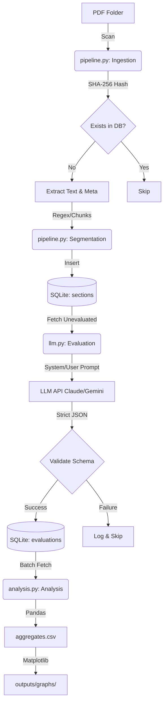

# 🛠 Course Analysis Engine: Under the Hood

This document provides a technical deep-dive into how the Course Analysis Engine functions, from the moment a PDF is found to the final graphical output.

---

## 🏗 Pipeline Architecture

The pipeline is designed as a **Linear Batch Engine**. Each step is idempotent (you can run it multiple times without corruption) and relies on the state stored in the SQLite database.



---

## 🔍 Under the Hood Logic

### 1. Ingestion & Hashing
- **Tool**: `hashlib` (SHA-256).
- **Reasoning**: Instead of tracking by filename (which can change), we track the content. If you move a file or rename it, the app knows it's the same content and won't re-bill you for LLM tokens.
- **Source Detection**: It automatically captures the parent folder name as the "source" (e.g., `Coursera`, `Internal_Docs`).

### 2. The Segmentation Strategy
Text is split into "Sections" to keep LLM context windows manageable and costs low.
- **Primary**: Heading Detection. It looks for lines starting with numbers (e.g., `1.1`) or ALL CAPS lines shorter than 60 chars.
- **Secondary**: Overflow Chunks. If a section is longer than 12,000 characters without a heading, it forces a split at the next newline to prevent overflow.

### 3. LLM JSON Mode
- **Validation**: Every response is checked against a `jsonschema`. If the LLM misses a key (like `evidence` or `scores`), the app refuses to save it to the DB.
- **Fallback**: If Claude (primary) returns an error or you don't have a key, it transparently tries Gemini.

---

## 🗄 Working with the Database

The database (`course_analysis.db`) is your source of truth. You can query it using any SQLite browser (like DB Browser for SQLite) or the CLI.

### Table Schema Highlights
- `courses`: `id` (hash), `filename`, `source`.
- `sections`: `course_id`, `section_index`, `content`.
- `evaluations`: `section_id`, `model_name`, `rubric1`...`rubric7`, `issues`, `fixes`.

### Useful SQL Queries

**See Average Scores per Course:**
```sql
SELECT c.filename, AVG(e.rubric1) as goal_focus, AVG(e.rubric2) as readability
FROM courses c
JOIN sections s ON c.id = s.course_id
JOIN evaluations e ON s.id = e.section_id
GROUP BY c.id;
```

**Find sections with the most issues:**
```sql
SELECT c.filename, s.section_index, e.issues 
FROM evaluations e
JOIN sections s ON e.section_id = s.id
JOIN courses c ON s.course_id = c.id
WHERE json_array_length(e.issues) > 3;
```

---

## 📝 Logs: What to Expect

### Healthy Logs
```text
Ingesting Dsa.pdf...
  -> Extracted 86 sections.
  -> Saved to DB.
Evaluating section 1 of Dsa.pdf...
Calling Anthropic (claude-3-5-sonnet-20241022)...
  -> Saved.
```

### Warning Logs
- `Skipping [File] (already exists)`: The hash was found in the DB.
- `Fallback to Gemini...`: Your Anthropic key is missing or failed.
- `Validation Error: 'scores' is a required property`: The LLM output was malformed. It will try again in the next run.

---

## ⚠️ What Could Go Wrong?

1.  **Quota Exhaustion (429 Error)**:
    - **Symptom**: `RESOURCE_EXHAUSTED` in logs.
    - **Fix**: The app has a 2-second delay between calls, but for large batches, you might need to increase the `time.sleep()` in `main.py` or use a paid tier API key.

2.  **Malformed PDFs**:
    - **Symptom**: `Error extracting [File]: ...`.
    - **Fix**: If the PDF is an image (OCR required), `pypdf` will return empty text. You will need to OCR the PDF before ingestion.

3.  **Database Lock**:
    - **Symptom**: `sqlite3.OperationalError: database is locked`.
    - **Fix**: Ensure you don't have the database file open in an editor that takes a persistent write lock while the script is running.

4.  **Schema Mismatch**:
    - If you change the rubrics in `llm.py`, you **must** update `schema.sql` and run `python main.py reset`.
